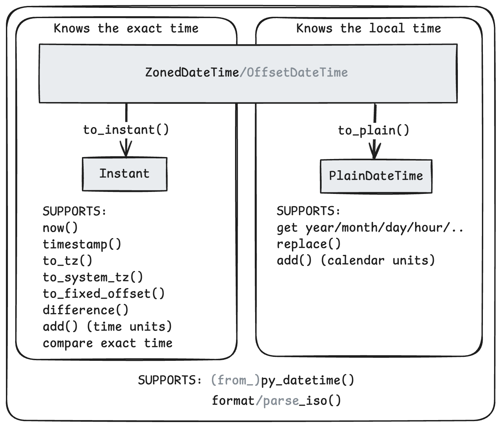

.. _api:

📖 API reference
================

All classes are immutable.

Datetimes
---------

Below is a simplified overview of the datetime classes and how they relate to each other.

Common behavior
~~~~~~~~~~~~~~~

The following base classes encapsulate common behavior.
They are not meant to be used directly.

.. autoclass:: whenever._BasicConversions
   :members:
   :inherited-members:
   :member-order: bysource

.. autoclass:: whenever._ExactTime
   :members:
   :member-order: bysource
   :special-members: __eq__, __lt__, __le__, __gt__, __ge__, __sub__
   :show-inheritance:

.. autoclass:: whenever._LocalTime
   :members:
   :undoc-members: year, month, day, hour, minute, second, nanosecond
   :member-order: bysource
   :show-inheritance:

.. autoclass:: whenever._ExactAndLocalTime
   :members:
   :member-order: bysource
   :show-inheritance:

Concrete classes
~~~~~~~~~~~~~~~~

.. autoclass:: whenever.Instant
   :members:
     from_utc,
     format_rfc2822,
     parse_rfc2822,
     add,
     subtract,
     round,
   :special-members: __add__, __sub__
   :member-order: bysource
   :show-inheritance:

   .. autoattribute:: MIN
   .. autoattribute:: MAX

.. autoclass:: whenever.PlainDateTime
   :members:
     assume_utc,
     assume_fixed_offset,
     assume_tz,
     assume_system_tz,
     parse_strptime,
     difference,
   :special-members: __eq__
   :member-order: bysource
   :show-inheritance:

   .. autoattribute:: MIN
   .. autoattribute:: MAX

.. autoclass:: whenever.OffsetDateTime
   :members:
     format_rfc2822,
     parse_rfc2822,
     parse_strptime,
   :member-order: bysource
   :show-inheritance:

.. autoclass:: whenever.ZonedDateTime
   :members:
     tz,
     is_ambiguous,
     start_of_day,
     day_length,
   :member-order: bysource
   :show-inheritance:

.. autoclass:: whenever.SystemDateTime
   :members:
     is_ambiguous,
     start_of_day,
     day_length,
   :member-order: bysource
   :show-inheritance:

Deltas
------

.. autofunction:: whenever.years
.. autofunction:: whenever.months
.. autofunction:: whenever.weeks
.. autofunction:: whenever.days

.. autofunction:: whenever.hours
.. autofunction:: whenever.minutes
.. autofunction:: whenever.seconds
.. autofunction:: whenever.milliseconds
.. autofunction:: whenever.microseconds
.. autofunction:: whenever.nanoseconds

.. autoclass:: whenever.TimeDelta
   :members:
   :special-members: __eq__, __neg__, __add__, __sub__, __mul__, __truediv__, __bool__, __abs__, __gt__
   :member-order: bysource

.. autoclass:: whenever.DateDelta
   :members:
   :special-members: __eq__, __neg__, __abs__, __add__, __sub__, __mul__, __bool__
   :member-order: bysource

.. autoclass:: whenever.DateTimeDelta
   :members:
   :special-members: __eq__, __neg__, __abs__, __add__, __sub__, __bool__, __mul__
   :member-order: bysource

.. _date-and-time-api:

Date and time components
------------------------

.. autoclass:: whenever.Date
   :members:
   :special-members: __eq__, __lt__, __le__, __gt__, __ge__, __sub__, __add__

.. autoclass:: whenever.YearMonth
   :members:
   :special-members: __eq__, __lt__, __le__, __gt__, __ge__

.. autoclass:: whenever.MonthDay
   :members:
   :special-members: __eq__, __lt__, __le__, __gt__, __ge__

.. autoclass:: whenever.Time
   :members:
   :special-members: __eq__, __lt__, __le__, __gt__, __ge__

Miscellaneous
-------------

.. autoenum:: whenever.Weekday
   :members:
   :member-order: bysource

.. autoexception:: whenever.RepeatedTime
   :show-inheritance:

.. autoexception:: whenever.SkippedTime
   :show-inheritance:

.. autoexception:: whenever.InvalidOffsetError
   :show-inheritance:

.. autoexception:: whenever.TimeZoneNotFoundError
   :show-inheritance:

.. autoclass:: whenever.patch_current_time

.. data:: whenever.TZPATH
   :type: tuple[str, ...]

   The paths in which ``whenever`` will search for timezone data.
   By default, this is determined the same way as :data:`zoneinfo.TZPATH`,
   although you can override it using :func:`whenever.reset_tzpath` for ``whenever`` specifically.

.. autofunction:: whenever.clear_tzcache
.. autofunction:: whenever.reset_tzpath
.. autofunction:: whenever.available_timezones
