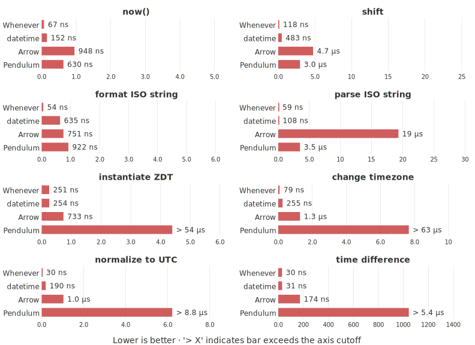

(benchmarks)=
# Benchmarks

`whenever` is compared against Python's standard library (+ `dateutil`),
[Arrow](https://pypi.org/project/arrow/), and [Pendulum](https://pypi.org/project/pendulum/)
across nine common datetime operations.

Benchmarks are run with [pyperf](https://pyperf.readthedocs.io/) on an
Apple M1 Pro (32 GB, macOS 26.3) using Python 3.14.3 (PGO+LTO),
whenever 0.9.5, Arrow 1.4.0, and Pendulum 3.2.0.

## Timing

*Lower is better.  Bars exceeding the axis cutoff are annotated with `>`.*

```{raw} html
<picture>
  <source media="(prefers-color-scheme: dark)"
          srcset="_static/benchmarks/timing-dark.svg">
  
</picture>
```

## Why is whenever faster?

- **No layering.** Arrow and Pendulum wrap Python's `datetime.datetime` rather
  than replacing it. Every operation pays the overhead of crossing extra Python
  abstraction layers that `whenever` avoids entirely.

- **Optimised parsing and formatting.** The Rust extension uses hand-written,
  single-pass byte-level parsers and formatters: no regex, no intermediate string
  objects, no `strptime`/`strftime` round-trips.

- **Front-loaded computation.** Every `ZonedDateTime` stores its UTC offset at
  construction time. Operations like "normalize to UTC" or "subtract two instants"
  become simple integer arithmetic with no timezone database lookup at operation
  time. This also makes timezone conversion and arithmetic consistently fast.

- **Compiled core.** The default wheel is a Rust CPython extension, giving
  C-level performance with safe, auditable code. The pure-Python fallback still
  benefits from the front-loaded computation model and outperforms Arrow on most
  simple operations.

```{admonition} What about the pure-Python version of whenever?
:class: hint

For simple operations — `now()`, ISO parsing,
UTC normalization — it is noticeably faster than Arrow and Pendulum. For
timezone-heavy operations such as `ZonedDateTime` construction or timezone
conversion it is slower, as those use pure-Python timezone code instead
of the C-optimized `zoneinfo` module. 
Overall it is in the same ballpark as Arrow and Pendulum.
```

---

## Running the benchmarks yourself

See `benchmarks/comparison/README.md` for setup instructions.

```shell
cd benchmarks/comparison
./run.sh --fast --update-docs   # quick run, update these charts
uv run python run_whenever.py --only now --fast   # single benchmark
```
