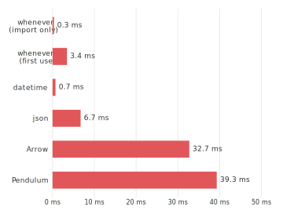
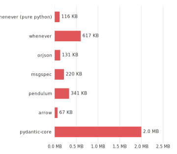

(benchmarks)=
(performance)=
# Performance

`whenever` optimizes for three goals that are sometimes in tension:

1. **Runtime speed** — operations should be as fast as possible
2. **Import time** — `import whenever` should feel instant
3. **Package size** — the wheel should stay small for fast/slim installs

These goals can conflict: aggressive inlining improves runtime speed but
increases binary size, which in turn inflates import time.
`whenever` targets a balance, sacrificing a bit of runtime speed in cold
code paths to keep the module compact and fast to import.

```{admonition} Test environment
:class: hint

All benchmarks on this page were run on an Apple M1 Pro (32 GB, macOS 26.3)
using Python 3.14.3 (PGO+LTO build). Import-time measurements use warm
page cache.
```

---

## Runtime speed

`whenever` is compared against Python's standard library (+ `dateutil`),
[Arrow](https://pypi.org/project/arrow/), and [Pendulum](https://pypi.org/project/pendulum/)
across common datetime operations.

*Lower is better.  Bars exceeding the axis cutoff are annotated with `>`.*

```{raw} html
<picture>
  <source media="(prefers-color-scheme: dark)"
          srcset="_static/benchmarks/timing-dark.svg">
  
</picture>
```

Why is `whenever` faster?

- **No layering.** Arrow and Pendulum wrap Python's `datetime.datetime` rather
  than replacing it. Every operation pays the overhead of crossing extra Python
  abstraction layers that `whenever` avoids entirely.

- **Optimised parsing and formatting.** The Rust extension uses hand-written,
  single-pass byte-level parsers and formatters: no regex, no intermediate string
  objects.

- **Front-loaded computation.** Every `ZonedDateTime` stores its UTC offset at
  construction time. Operations like "normalize to UTC" or "subtract two instants"
  become simple integer arithmetic with no timezone database lookup at operation
  time.

- **Compiled core.** The default wheel is a Rust extension, giving C-level
  performance with safe, auditable code. The pure-Python fallback still
  benefits from the front-loaded computation model and outperforms Arrow on most
  simple operations.

```{admonition} What about the pure-Python version of whenever?
:class: hint

For simple operations — `now()`, ISO parsing,
UTC normalization — it is noticeably faster than Arrow and Pendulum. For
timezone-heavy operations such as `ZonedDateTime` construction or timezone
conversion it is slower, as those use pure-Python timezone code instead
of the C-optimized `zoneinfo` module.
Overall it is in the same ballpark as Arrow and Pendulum.
```

---

## Import time

`import whenever` is nearly free because the package defers all heavy
work until the first attribute access.
`import datetime` is faster on standard CPython builds because `_datetime` is
statically linked into the interpreter. Third-party packages cannot match that.

*Other libraries shown for context.*

```{raw} html
<picture>
  <source media="(prefers-color-scheme: dark)"
          srcset="_static/benchmarks/import-time-dark.svg">
  
</picture>
```

Import time is mainly kept low through lazy loading of submodules and dependencies:

- The `__init__.py` uses module-level `__getattr__` (PEP 562) to defer the
  extension load until first access.
  Code that imports `whenever` but doesn't use it pays essentially nothing.
- Dependencies (`datetime`, `zoneinfo`, `pydantic`, `typing`)
  are imported on first use, not at module load.

---

## Package size

The chart below compares wheel sizes of `whenever` against other
datetime libraries, as well as some unrelated libraries for context.
A pure-Python wheel is also available for environments where install size
or platform coverage matters more than runtime speed.

```{raw} html
<picture>
  <source media="(prefers-color-scheme: dark)"
          srcset="_static/benchmarks/package-size-dark.svg">
  
</picture>
```

`whenever`'s focus on runtime speed and rich API means it is relatively large.
It keeps the wheel size reasonable through careful design choices:

- Several types (`Weekday`, `YearMonth`, `MonthDay`, `IsoWeekDate`) are
  implemented only in Python even when the extension is active, keeping the
  native binary focused on the performance-critical datetime types.
- Inlining is used judiciously: hot code paths are optimized, while cold paths
  are prevented from inflating the binary size.

Trade-offs not taken:

- Full, descriptive docstrings (almost 100 KB) are included in the wheel.
- Panics in Rust code are caught and converted to Python exceptions, which
  requires unwinding tables and increases binary size. `orjson` compiles
  with `panic = "abort"` to avoid this overhead, but `whenever` prioritizes
  safety and debuggability over minimal size.
- Rust extensions have more overhead per method than C extensions,
  but this is worth the safety and maintainability benefits.


---

## Running the benchmarks yourself

See `benchmarks/comparison/README.md` for setup instructions.

```shell
cd benchmarks/comparison
./run.sh --fast --update-docs   # quick run, update these charts
uv run python run_whenever.py --only now --fast   # single benchmark

# Import time and package size charts:
uv run python perf_charts.py --python $(which python) --output ../../docs/_static/benchmarks/
```
